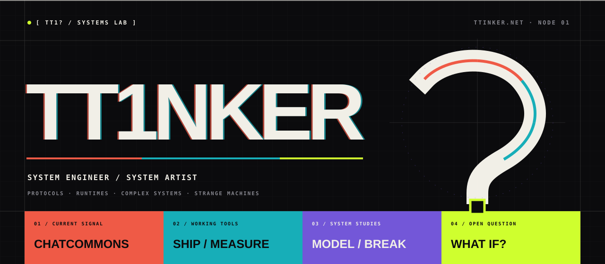
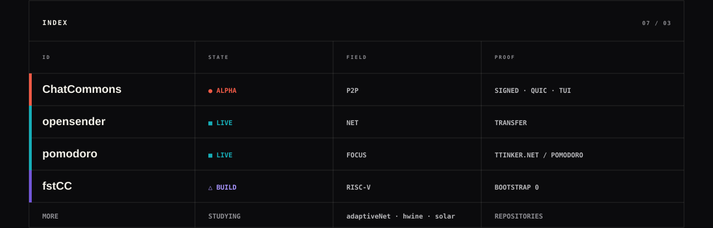

  

  <a href="https://ttinker.net"><strong>TTINKER.NET ↗</strong></a> &nbsp;·&nbsp;
  <a href="https://github.com/TT1nKer?tab=repositories">REPOS</a> &nbsp;·&nbsp;
  <a href="https://github.com/TT1nKer/chatcommons">● CHATCOMMONS</a>

I build systems that make their structure visible: protocols, runtimes,
hardware experiments, and small tools for problems I actually had.

  

### Current signal

**[ChatCommons](https://github.com/TT1nKer/chatcommons)** is an offline-first
protocol for community-owned chat. Signed events, replaceable home servers,
direct or relayed QUIC, and a native text client exist today. It remains a
friends-and-contributors alpha, not a production service.

### System links

**Working:** [opensender](https://github.com/TT1nKer/opensender) · [pomodoro](https://github.com/TT1nKer/pomodoroAKAtimer) · [StockItsMygo](https://github.com/TT1nKer/StockItsMygo) 
**Building:** [fstCC](https://github.com/TT1nKer/fstCC) · [ChatCommons](https://github.com/TT1nKer/chatcommons) 
**Studying:** [adaptiveNet](https://github.com/TT1nKer/adaptiveNet) · [hwine](https://github.com/TT1nKer/hwine) · [solar](https://github.com/TT1nKer/solar)

`LESS SURFACE · MORE STRUCTURE · LESS MAGIC · MORE CONTROL`

AI is part of the toolchain. Status comes from what can be built, observed, or
reproduced—not from how polished the claim sounds.
