<p align="center">
  
</p>

```text
$ whoami
tt1nker


$ cat /etc/os-release
NAME="tt1nker"
ID=human
VARIANT="linux first · low-level by training · agents by curiosity"
HOME_URL="github.com/TT1nKer"
SUPPORT_URL="hostsjimi@gmail.com"
BUILD_ID=2026.04


$ uname -a
tt1nker arch-linux-x86_64 #1 SMP PREEMPT_DYNAMIC online-since 2025-06 unsleep


$ pacman -Qe                              # explicitly installed
ai/agent-workflows                        latest
ai/mcp                                    latest
ai/claude-api                             latest
fullstack/vue                             stable
fullstack/python                          stable
fullstack/javascript                      stable
linux/arch                                rolling
linux/dotfiles                            git
linux/shell                               daily-driven
lowlevel/c                                c11
lowlevel/cpp                              c++17
lowlevel/asm                              x86_64
lowlevel/compilers                        0.0.1
lowlevel/stm32-firmware                   bare-metal
sim/life-simulation                       speculative
sim/narrative-agents                      experimental


$ ls -lah ~/projects
drwxr-xr-x  fstCC                     ·  c compiler in raw assembly
drwxr-xr-x  bootloader-stm32f1xx-     ·  bare-metal stm32 bootloader
drwxr-xr-x  aigit                     ·  agent-driven git extension
drwxr-xr-x  AIC                       ·  ai character builder
drwxr-xr-x  DoomDay                   ·  life-sim · "that day comes"
-rwxr-xr-x  pomodoroAKAtimer          ·  single-file minimalist pomodoro       [shipped]
-rwxr-xr-x  dotfiles                  ·  arch + shell setup                    [shipped]


$ systemctl status tt1nker.service --no-pager
● tt1nker.service · operating
     Active:   online since 2025-06 · uptime: too much
     Memory:   compilers, ghosts, and the things you can't grep for
     CGroup:   /system.slice/agents.slice
               ├─ aigit         driving git from a custom agent loop
               ├─ AIC           spawning ai characters
               ├─ DoomDay       simulating futures that haven't arrived
               └─ fstCC         transpiling c, by hand, from assembly

[  ok  ] reached target multi-user.target
[ wait ] /opt/sleep . . . . . . . . . . . . . . . . . . unreachable


$ cat ~/.ssh/contact.pub
hostsjimi@gmail.com


$ _
```
