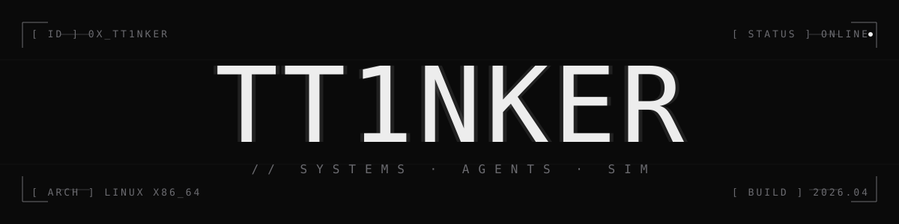

<p align="center">
  
</p>

```text
$ systemctl status tt1nker.service --no-pager

● tt1nker.service · operating
     Loaded:   /etc/identity (linux first, low-level by training)
     Active:   online since 2025-06 · uptime: too much
     Drop-In:  /lib/systemd/curiosity.d/agents.conf
     Memory:   compilers, ghosts, and the things you can't grep for
     CGroup:   /system.slice/agents.slice
               ├─ aigit         driving git from a custom agent loop
               ├─ AIC           spawning ai characters
               ├─ DoomDay       simulating futures that haven't arrived
               └─ fstCC         transpiling c, by hand, from assembly

[  ok  ] reached target multi-user.target.
[ wait ] /opt/sleep . . . . . . . . . . . . . . . . . . unreachable
```

```text
//  stack ───────────────────────────────────────────────────────────

    ai          ███████░░░    agent workflows · mcp · claude api
    full-stack  █████░░░░░    vue · python · javascript · single-file
    linux       ████████░░    arch · dotfiles · shell · daily-driven
    low-level   █████████░    c · c++ · assembly · compilers · stm32
    sim         █████░░░░░    life simulation · narrative agents
```

```text
//  fragments  /  in progress ───────────────────────────────────────

    fstCC                      ·  c compiler in raw assembly
    bootloader-stm32f1xx-      ·  bare-metal stm32 bootloader
    aigit                      ·  agent-driven git extension
    AIC                        ·  ai character builder
    DoomDay                    ·  life-sim · "that day comes"

//  fragments  /  shipped ─────────────────────────────────────────────

    pomodoroAKAtimer           ·  single-file minimalist pomodoro
    dotfiles                   ·  arch + shell setup
```

```text
//  transmission ────────────────────────────────────────────────────

    $ echo "$EMAIL"
    hostsjimi@gmail.com

    $ _
```
