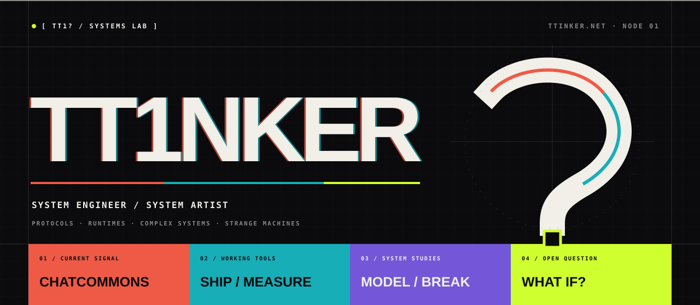
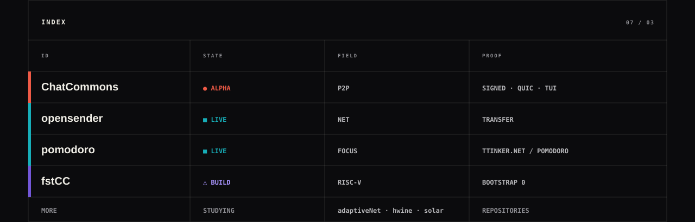

<p align="center">
  <a href="https://ttinker.net">
    
  </a>
</p>

<p align="center">
  <a href="https://ttinker.net"><strong>TTINKER.NET ↗</strong></a> &nbsp;·&nbsp;
  <a href="https://github.com/TT1nKer?tab=repositories">REPOS</a>
</p>

I keep coming back to one question:

> **How do many simple components, local rules, and physical constraints become the behavior of a whole system?**

That question first pulled me toward physics and complex systems. It now pulls me toward
**GPU/HPC, computer architecture, compilers, and performance engineering**.

I am especially interested in the **physical cost of computation**: why machines that are
functionally capable of the same computation — CPU, GPU, FPGA, ASIC, or something stranger —
can have radically different efficiency, and how compiler mapping, memory hierarchy, locality,
parallelism, communication, and specialization determine the difference.

<p align="center">
  
</p>

## Current direction

I am moving from broad systems exploration toward deeper work in accelerated computing.

Right now I am studying GPU performance from the bottom up: matrix multiplication, the CUDA
execution model, memory movement, tiling, arithmetic intensity, occupancy, and profiling. My
longer-term interest is not just "how to make one kernel faster," but how much of performance
engineering can be **generalized or automated without hiding the hardware structure that creates
performance in the first place**.

## Projects as experiments

Not every repository here is a finished product. I often build far enough to test an idea,
understand where the abstraction works or breaks, and then either narrow the problem, pause it,
or carry the lesson into the next system.

### [lowalt-vision-platform](https://github.com/TT1nKer/lowalt-vision-platform) — real-world ML pipeline

This grew out of my 2026 China Telecom internship. The basic idea was to turn expensive
foundation-model analysis into a repeatable data pipeline for lightweight downstream models:
tile aerial imagery, generate and review annotations, preserve geospatial metadata, and train
task-specific YOLO models.

The interesting failure was **parking lots**. Cars, buildings, rivers, and other object-like
classes fit the original pipeline much better; a parking lot is a contextual semantic region,
not a clean object. That pushed the work toward semantic segmentation and SegFormer-based
parking analysis instead of pretending one representation solved every task.

**Lesson:** sometimes the pipeline is fine and the problem formulation is wrong.

### [fstCC](https://github.com/TT1nKer/fstCC) — compiler-construction learning prototype

I started fstCC before I had formally studied compilers and used the project to learn the path
from source text to machine code: lexing, recursive-descent parsing, code generation, calling
conventions, and staged bootstrapping.

Stage 0 currently records **39/39 passing tests** for its L0 C subset under the RISC-V/QEMU
toolchain. It is not self-hosting; stages 1 and 2 remain future work.

**Lesson:** a concrete machine is often the fastest way for me to turn an abstract subject into
something I can reason about.

### [ChatCommons](https://github.com/TT1nKer/chatcommons) — paused communication-system prototype

ChatCommons started from a much larger question: what would a community communication system
look like if ownership, offline operation, and replaceable infrastructure were first-class
constraints rather than afterthoughts?

The repository reached a friends-and-contributors alpha with signed events, SQLite persistence,
direct/relayed QUIC synchronization, invitations, and a minimal native text client. I paused the
project before productionization because the product scope became larger than I could reasonably
maintain alongside school.

**Lesson:** a prototype can answer architectural questions long before it becomes a product —
and scope is itself an engineering constraint.

### [adaptiveNet](https://github.com/TT1nKer/adaptiveNet) — complex systems made explorable

adaptiveNet puts eleven published dynamical systems behind one interactive browser interface:
Ising spins, Hopfield memory, Gray-Scott reaction-diffusion, adaptive voter dynamics, spiking
neurons, and others.

The point is not to claim new physics. It is to make the shared pattern visible: many units,
local interactions, and macroscopic behavior that is hard to understand from a static equation
or figure alone.

**Lesson:** different domains often become easier to understand once the common structure is
made explicit.

## How I work

My default instinct is to generalize everything. I am learning to delay that instinct until the
concrete case is understood:

```text
build one case → measure it → find where it breaks → understand why → generalize
```

That is the workflow I want to carry into HPC and systems research.

## System links

**Working:** [opensender](https://github.com/TT1nKer/opensender) · [pomodoro](https://github.com/TT1nKer/pomodoroAKAtimer) · [StockItsMygo](https://github.com/TT1nKer/StockItsMygo)<br>
**Exploring:** [fstCC](https://github.com/TT1nKer/fstCC) · [adaptiveNet](https://github.com/TT1nKer/adaptiveNet) · [hwine](https://github.com/TT1nKer/hwine)<br>
**Paused:** [ChatCommons](https://github.com/TT1nKer/chatcommons)

`LESS SURFACE · MORE STRUCTURE · LESS MAGIC · MORE CONTROL`

AI is part of my toolchain. I use it aggressively for implementation and iteration, but I try
to separate **code that exists** from **ideas I can explain, test, reproduce, and defend**.
